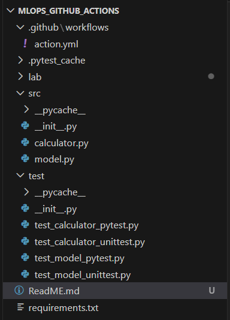
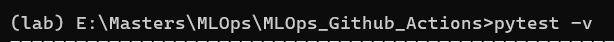
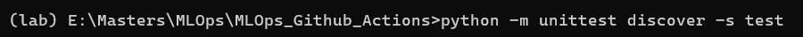

## MLOPS Github Actions Lab

This repository demonstrates a complete CI pipeline for a basic Machine Learning algorithm and Python modules using GitHub Actions.
It includes:

- A simple ML model using the Wine dataset from scikit-learn

- A basic calculator module

- PyTest and unittest test suites

- Automated CI workflow running all tests on every push or PR

## Project Structure

## ML model

The ML component uses the Wine classification dataset from scikit-learn and trains it on a RandomForestClassifier model

## Calculator

A simple calculator that adds, subtracts, multiplies, divides and performs combo operations.

## Test

It is located inside the test directory.
To run the tests locally, run : 
1) "pytest -v"

2) "python -m unittest discover -s test"

All the tests will pass if everything is working properly.

## Github Action

The workflow runs on every push or pull request.

Each time it performs:
1) Check the source code
2) Set up python
3) Install dependencies
4) Run Pytests
5) Run Unittest
6) Fail the build if any it fails